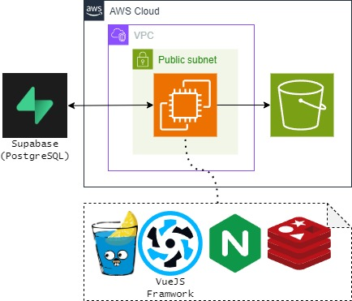

# 簡介
這是我剛開始學習 GO 的專案，使用 [Gin](https://github.com/gin-gonic/gin) 框架開發的一個音樂劇 wiki

# 架構

## Infra
[Terraform Repository](https://github.com/FallPrediction/musical_wiki_terraform)、[Ansible Repository](https://github.com/FallPrediction/musical_wiki_ansible)

此專案為 monolith，使用 Terraform 建立 VPC、EC2 及 S3 等資源，並用 Ansible 在 EC2 啟動 Nginx 及 Redis，最後透過 Gihub action 觸發 CodeDeploy 部署。資料庫使用託管的 Supabase

想使用 Terraform 建立常見的 ALB、EC2、RDS、CloudFront 架構資源，可以參考[我的另一個 repository](https://github.com/FallPrediction/web-terraform-example)

## 後端
因為習慣 PHP 的Laravel，所以這個專案的某些檔案目錄會參照 Laravel，如：
- handler(controller)：驗證輸入和 Response
- service：業務邏輯
- repository：跟 DB 溝通
- models：因為使用了 Gorm，該資料夾定義各 model 的 field，透過 orm 操作資料庫
- helper：全局用的小功能。並且使用 testing 寫測試
- request：各 API input 的驗證規則
- initialize：初始化部件，大部分都用 singleton，如 Redis, DB Connection 等
- utils：把常用的功能包裝成 struct，目前有上傳和 cache
- deployments
    - local：本地開發用的環境檔
    - codeDeploy：AWS Code Deploy 用的 scripts

## 前端
[Repository](https://github.com/FallPrediction/musical_wiki_frontend)\
使用 Vue 的 UI 框架 [Quasar](https://github.com/quasarframework/quasar)

# 本地開發
Docker Compose 啟動 GO、PostgreSQL、Redis 和 Nginx 服務\
如何設定 GO 開發環境可以參考我的部落格文章[用 VSCode Debug GO 程式吧](https://fallprediction.github.io/blog/posts/vscode-debug-go/)\
如果要部署到 EC2，可以參考我的部落格文章 [CodeDeploy 部署 GO APP 到 EC2](https://fallprediction.github.io/blog/posts/code-deploy/)
